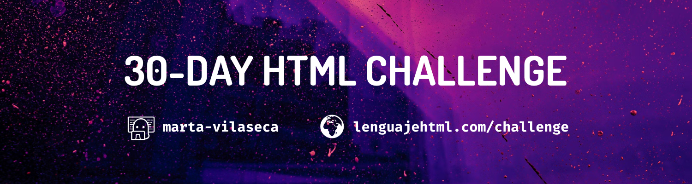

Mis soluciones para los retos del HTML 30 day challenge propuesto por **[@ManzDev](https://github.com/ManzDev)** en https://lenguajehtml.com/challenge/

Mi reto personal, ya que llevo años trasteando con HTML y CSS, será intentar llevar todos los retos un pasito más allá - ya sea añadiendo detalles extra o probando cosas que no haya probado antes 🤓

## Retos y soluciones  

| #  | Reto                                                                                                                  | Solución       |
|----|-----------------------------------------------------------------------------------------------------------------------|----------------|
| 01 | Crea una página HTML con código CSS desde un archivo diferente.                                                       | [📁 01/](/01/) |
| 02 | Crea una página con un titular, varios párrafos de texto y una imagen.                                                | [📁 02/](/02/) |
| 03 | Construye una página con un párrafo que tenga enlaces internos y externos (a otros sitios web).                       |                |
| 04 | Valida el código HTML de tus ejemplos anteriores (y los siguientes a partir de ahora).                                |                |
| 05 | Ponle un título y una descripción al documento, ideal para SEO.                                                       |                |
| 06 | Crea un grupo de secciones (acordeón) donde se despliegue sólo uno a la vez.                                          |                |
| 07 | Coloca una imagen en formato JPEG-XL. Si el navegador no la soporta, que use AVIF. Sino, que use JPG.                 |                |
| 08 | Crear un párrafo de texto con palabras destacadas en diferentes colores.                                              |                |
| 09 | Crea un pergamino con una lista de objetos, donde se numere con números romanos (mayúsculas).                         |                |
| 10 | Inserta un video de Youtube en una página y estila con CSS para que se vea bien.                                      |                |
| 11 | Escribe un texto con super/subíndices (fórmulas químicas, por ejemplo).                                               |                |
| 12 | Crea un slider que permita seleccionar un número entre 1-50 y lo muestre en vivo al cambiar.                          |                |
| 13 | Crea una barra medidora que muestre los tickets vendidos en un cine (64/100 tickets vendidos).                        |                |
| 14 | Muestra un bloque de fragmento de código CSS en una página (sin resaltado de colores).                                |                |
| 15 | Crea una página con un video MP4, que muestre una portada antes de darle a reproducir.                                |                |
| 16 | Muestra un texto con el atajo de teclado CTRL+ALT+SUPR y dale estilo para que parezcan teclas.                        |                |
| 17 | Crea una card de usuario: username como título, un avatar, edad, país, nacimiento y enlace a su web.                  |                |
| 18 | Crea un pequeño artículo de prensa con una noticia inventada. Usa etiquetas HTML semánticas.                          |                |
| 19 | Crea una tabla con información. Incluye una cabecera y un pie de tabla. La última columna será de un color diferente. |                |
| 20 | Crea un formulario para dejar un comentario en una página: Usuario y comentario de texto.                             |                |
| 21 | Crea una lista desplegable donde se pueda seleccionar entre 3 grupos de productos ficticios.                          |                |
| 22 | En la lista anterior, permite al usuario introducir opciones personalizadas y filtrar de datos.                       |                |
| 23 | Crea un formulario que te permita elegir un día entre el 15/nov y el 15/dic.                                          |                |
| 24 | Crea un formulario de registro que valide si el username escrito es válido (sólo letras y números) o no.              |                |
| 25 | Crea una galería de fotos. Asegúrate que no se cargan si están fuera de la región visible del navegador.              |                |
| 26 | Crea un mensaje emergente al pulsar un botón, que desaparezca al pulsar fuera del mensaje.                            |                |
| 27 | Crea una serie de etiquetas que permitan mostrar como miniatura una imagen en redes sociales.                         |                |
| 28 | Crea una ventana modal que bloquee la interación con otros botones. Requiere un poco de Javascript.                   |                |
| 29 | Crea un sistema de pestañas (tabs) para mostrar información. Necesita algo de Javascript.                             |                |
| 30 | Carga una librería Javascript de confetti y lánzalo cuando pulses en un botón. Requiere algo de Javascript.           |                |